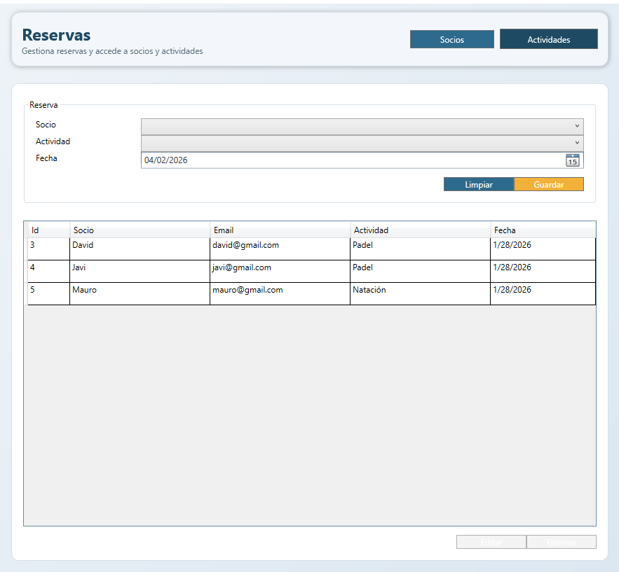
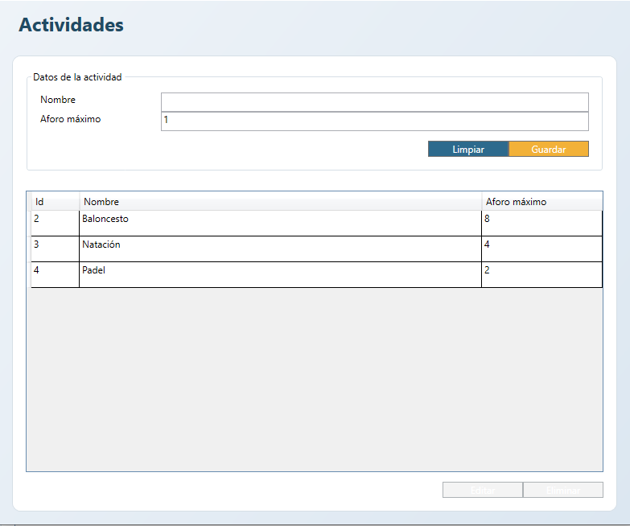
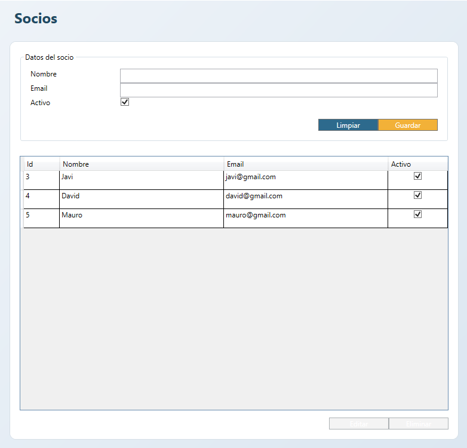

# CentroDeportivo

## Descripción del proyecto
Aplicación de escritorio para la gestión de un centro deportivo. Implementa el patrón MVVM con separación en proyectos `Model`, `ModelView` y `View`.

## Tecnologías usadas
- C#
- .NET Framework
- WPF
- Patrón MVVM

## Instalación
1. Clona este repositorio.
2. Abre la solución en Visual Studio.
3. Restaura dependencias si aplica.

## Cómo ejecutar
1. Establece el proyecto `View` como proyecto de inicio.
2. Compila la solución.
3. Ejecuta la aplicación desde Visual Studio.

## Manual de usuario
[Descargar manual de usuario](docs/pdf/Manual%de%usuario_Centro%Deportivo.pdf)

## Capturas
### Pantalla principal

### Gestión de actividades

### Gestión de socios

## Autores
- David Oviedo
